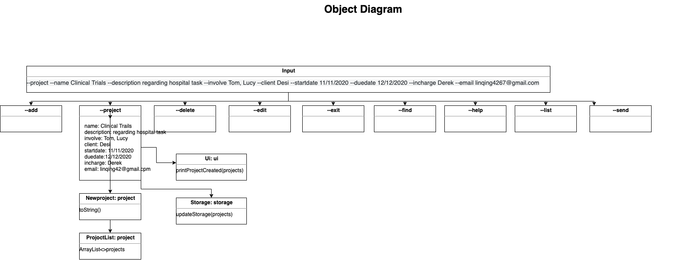
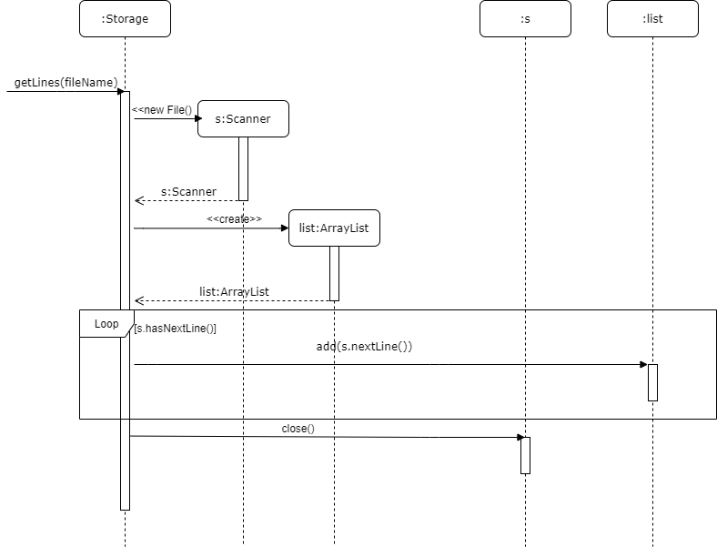

# Developer Guide

## Design & implementation

Project Tracker is a desktop app for managing and tracking projects,  optimized for use via a Command Line Interface (CLI). It will help the project manager to track the status of each project such as how many projects have been done per year or within a period.
and you can refer to [online website](https://ay2021s1-tic4001-1.github.io/tp/DeveloperGuide.html) .
## Design

### UML diagram 
 

### Object diagram 
 

### Storage method: getlines(string fileName)

## Product scope
### Target user profile

The target user is a project manager who can keep tracking various projects, know the progress of each project with  principal members to participate in each project. However, he cannot remember the progress of various projects, who is the member that involve to each specific project and cannot close monitor the progress of each project.

### Value proposition

Project Tracker will help to solve to tracking and managing projects. It will involve person-in-charge, members who involved in each project and the description of each project. Furthermore, the duration of the project will be included in this Project Tracker that helps the project manager to know the timeframe of each project.

## User Stories

|Version| As a ... | I want to ... | So that I can ...|
|--------|----------|---------------|------------------|
|v1.0|new user|see usage instructions|refer to them when I forget how to use the application|
|v1.0|project manager|create a project|put in the project information|
|v1.0|project manager|add a start and end date to my project| know the timeframe|
|v1.0|project manager|add employees to the project|know who are involved|
|v1.0|project manager|add person_on-charge|know who is leading the project|
|v1.0|project manager|add the description to the project|know what is the project about|
|v1.0|project manager|save my project|keep a record for reference|
|v1.0|project manager|delete my project| reduce the clutter|
|v1.0|project manager|include extra project information |add new member or add extra content in my project information|
|v1.0|project manager|update a project information|change or update the project without re-key in whole project information|
|v1.0|project manager|close the program|exit|
|v2.0|project manager|receive an email notification|remind myself|
|v2.0|project manager|have duration of project|know the how many employees need to assign to this project and save manpower|
|v2.0|project manager|add a status of project|know how many project still in progress or completed|
|v2.0|project manager|add a count down day for project|remind myself|
|v2.0|project manager|know the client|find client's information|
|v2.0|project manager|receive an email notification when the deadline is only left few days|focus on the project first|
|v3.0|project manager|Check date format in Find,Edit| so that only valid date allows|
|v3.0|project manager|Ensure duration is not negative and days left to Not Applicable| so that no negative number appear|
|v3.0|project manager|Catch all input exceptions for Send command| ensure is valid input in send|
|v3.0|project manager|validate email format| ensure correct email address|
|v3.0|project manager|create complete command to set a project to complete| Ensure project can update to be done|
|v3.0|project manager|add not allowed to start date, due date and email| limite the add, only meaningful data allow|
|v3.0|project manager|Fix all checkstyle errors| inorder to pass the CI test|

## Non-Functional Requirements

* Operation Environment: Project tracker works on any Mainstream OS as long as it has Java **11** or above installed. 
* Usability: A command line interface application, user will use specified command to interact with the system.
* Capacity: Project tracker should be able to record at least 1,000 project records. 
* Reliability / Availability: Once the project tracker has been successfully deployed on user's computer, availability is 24/7.   
* Scalability: The current version of project tracker only support local data file storage, users are unable to share a centralised project data.
               If the need of having a centralised data storage raised in the future, it can be added as system enhancement. 
* Security: User login is not required. The project tracker use user's computer login as authentication.
* Maintainability: A updated JAR file will be released to user if there is any update to the current version of the project tracker.                 
               
## Glossary

* Mainstream OS * - Windows, Mac and Linux

## Instructions for manual testing

Start the program
*    1. Download the Jar file and copy into an empty folder
*    2. Use terminal/CMD to run jar file with `java -jar` command.
*    3. type exit command or double enter to exit the program.
