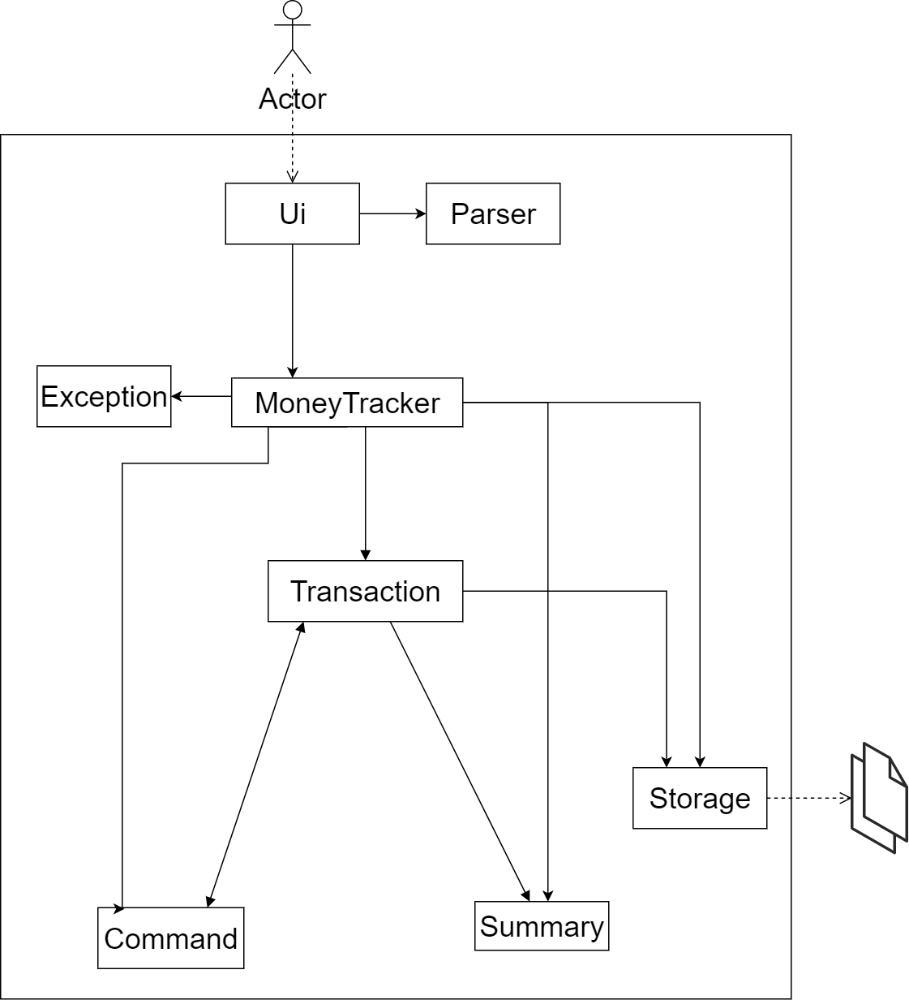
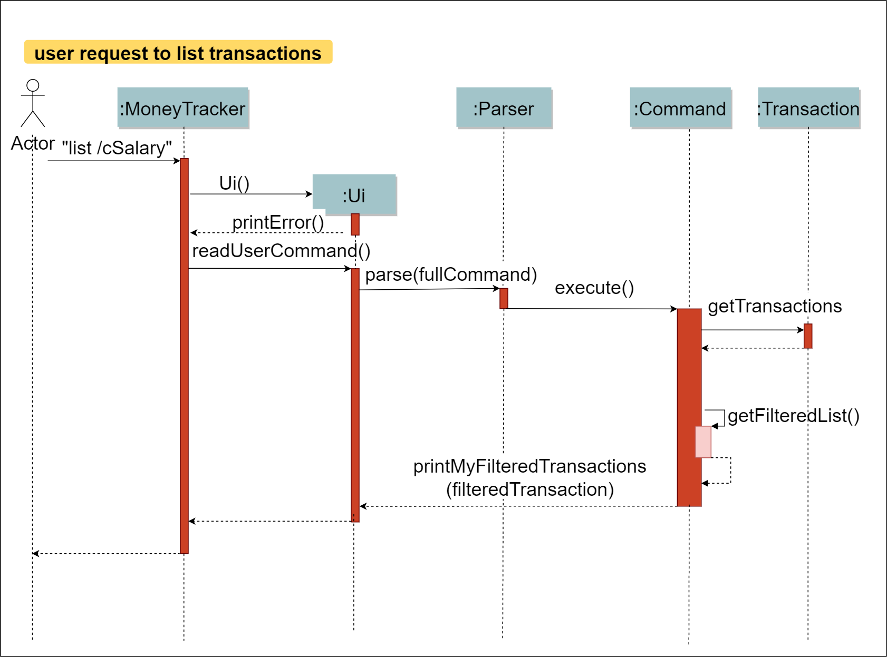

# Developer Guide

## **Design**
### Architecture
    

The ***Architecture Diagram*** given above explains the high-level design of the Money Tracker App.

MoneyTracker is the `Main` class. It is responsible for:
* At app launch: Initializes the components in the correct sequence, and connects them up with each other.
* At shut down: Shuts down the components.

The App consists of the following components.
* `UI`: The UI of the App.
* `Parser`: The parser executor.
* `Exception`: The exception executor.
* `Transaction`: Holds the transaction related records such as Category, Expense, Income.
* `Command`: The command executor.
* `Summary`: The summary executor and holds the Budget.
* `Storage`: Reads data from and writes data to the hard disk.

## Design & implementation

### **Design of Command Component: List, ListCategory**
**How the architecture components interact with each other**

The *Sequence Diagram* below shows how the components interact with each other for the scenario where the user issues the command `list /cSalary`.
    
The *Class Diagram* below shows how the components interact with each other for the scenario where the user issues the command `list /cSalary`.
    

The Command Component: List, ListCategory
* can list `transaction` objects to users based on the command rules.
* can list `category` objects to users based on the command rules.

### **Implementation of Command Component: List, ListCategory**

This section describes some noteworthy details on how certain features are implemented.

### \[Enhanced\] list feature

#### Enhanced Implementation
The enhanced list feature was implement for *ListCommand*. It extends ListCommand with more *flexibility* and *variety*. The users can enter the list command to filter the result as what they require such as list by income category, by expense category, by year month, by type. Also, the order of filter condition is flexible. 

* `list /te`: Lists all expense categories.
* `list /m2020-09`: Lists all transaction happened in 2020 September.
* `list /cSALARY`: Lists all SALARY.
* `list /te /cfood /m2020-09`: Lists all Food expense happened in 2020 September
* `list /m2020-09 /te`: Lists all expense happened in 2020 September

These operations are exposed in the `ListCommand()` class.
* Step 1: The user executes list command. 
* Step 2: The ListCommand() class will parser the user instruction keywords and save as rules. 
* Step 3: Then check the rules one by one and return matched transaction records by calling the method `getFilteredList`
* Step 4: Display the matched transaction records to the user.

The following sequence diagram shows how the list operation works:
    

The following activity diagram summarizes what happens when a user executes a list command:
    

#### Design consideration:
##### Aspect: How to check the list command rules

* **Alternative 1 (current choice):** Use Streams filter to check the list command rules.
  * Pros: Streams can succinctly express quite sophisticated behaviour. It encourages looser coupling and less mutability. This is because it is a more declarative approach that tells the application what we want to achieve, not how we want to achieve it. Easy to implement by using streams filter.
  * Cons: May have performance issues in terms of memory usage. Streams may be novel for some programmers.

* **Alternative 2:** Use “loop” and “if else” to check the list command rules.
  * Pros:  we are familiar with “loop” and “if else”. Will use less memory.
  * Cons: The logic of checking list command rules can become very complex, especially when there are multiple rules and order of rules is various every time. We must tell the application how we want to achieve based on the complex logic. We must ensure that the logic of checking can satisfy each case.

## Product scope
### Target user profile

This app targets young working adults in Singapore who are living on
a tight budget and would like to have better insight into their spending habits.

### Value proposition

This app allows users to track their incomes and expenses.
This helps them to stay within their budget and make timely adjustments to their spending habits when necessary.

## User Stories

|Version| As a ... | I want to ... | So that I can ...|
|--------|----------|---------------|------------------|
|v1.0|potential user|download the app|get a feel what the app can do|
|v1.0|potential user|browse through the user guide|get an overview of what are the commands available|
|v1.0|new user|access the user guide|refer to it when I forget how to use the app|
|v1.0|new user|add an income|keep track of my incomes|
|v1.0|new user|add an expense|keep track of my expenses|
|v1.0|new user|add an income category|group my incomes under this category|
|v1.0|new user|add an expense category|group my expense under this category|
|v1.0|new user|list my incomes and expenses|view all my monetary transactions|
|v1.0|user|list my income and expense categories|view all my income and expense categories|
|v1.0|user|clear all my data|start afresh with the app|
|v1.0|expert user|list my incomes and/or expenses based on a specified month|view my filtered transactions|
|v2.0|user|view my total income and expense of the month upon app startup|get an overview of my incomes and expenses|
|v2.0|user|view a report on my incomes and expenses for a specified month|get a deep insight of my incomes and expenses|
|v2.0|user|set a monthly budget|get notified when I exceed 50%, 75% and 100% of my budget|
|v2.0|expert user|edit an income or expense category|change the name of the category|
|v2.0|expert user|edit an income or expenses|change any of its parameters such as amount and date|
|v2.0|expert user|list my incomes and/or expenses based on a specified category|view my filtered transactions|
|v3.0|expert user|view the total incomes and expenses for the past six months|see the trend of my monthly incomes and expenses|

## Non-Functional Requirements

1. The app should work on any mainstream OS with Java `11` or above installed.
2. The response time for each command should not exceed `3` seconds.
3. A user with average typing speed should be able to enter any one command within `10` seconds.
4. After using each command for at least `3` times, a user with no cognitive disability should be able to
use all the app features without having to reference the user guide.

## Glossary

* *Mainstream OS* - Windows 7, Windows 10, Linux, Unix, OS-X

## Instructions for manual testing

{Give instructions on how to do a manual product testing e.g., how to load sample data to be used for testing}
